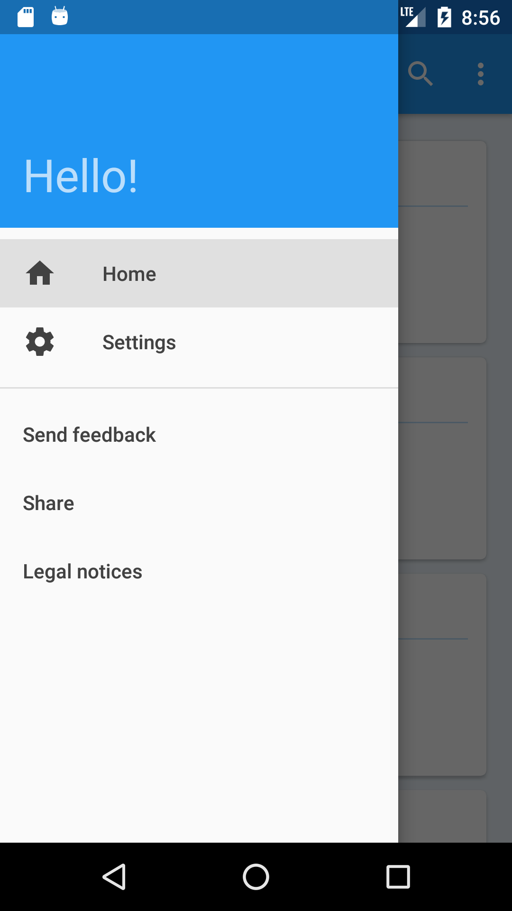
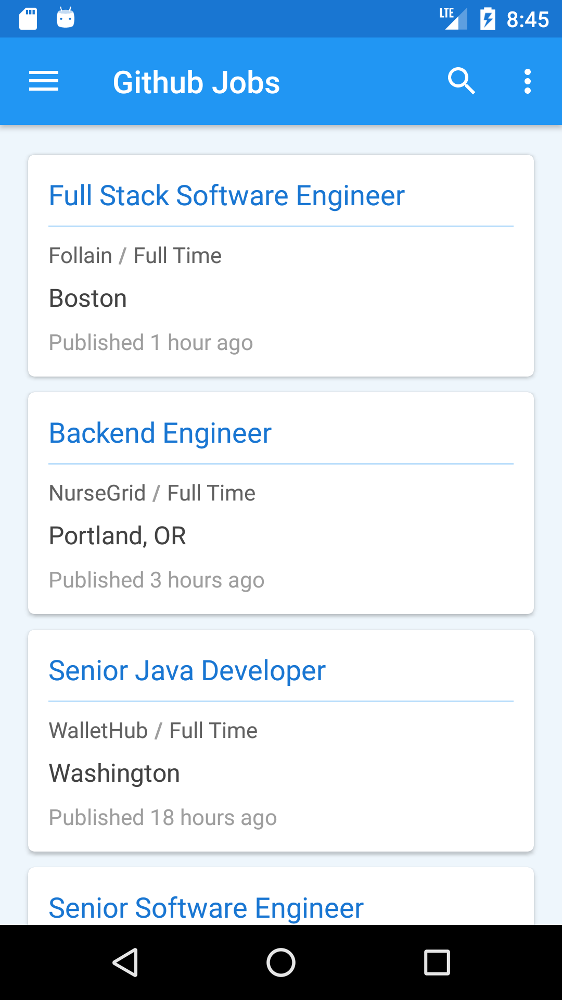
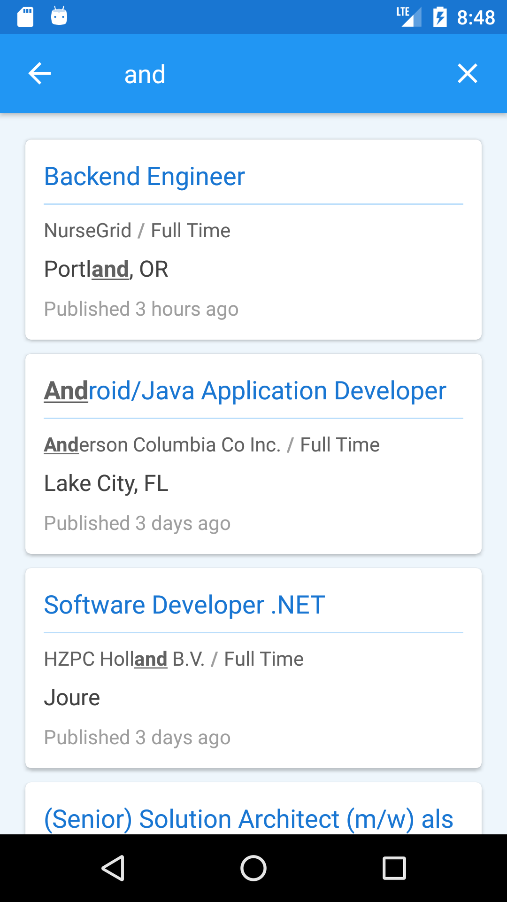
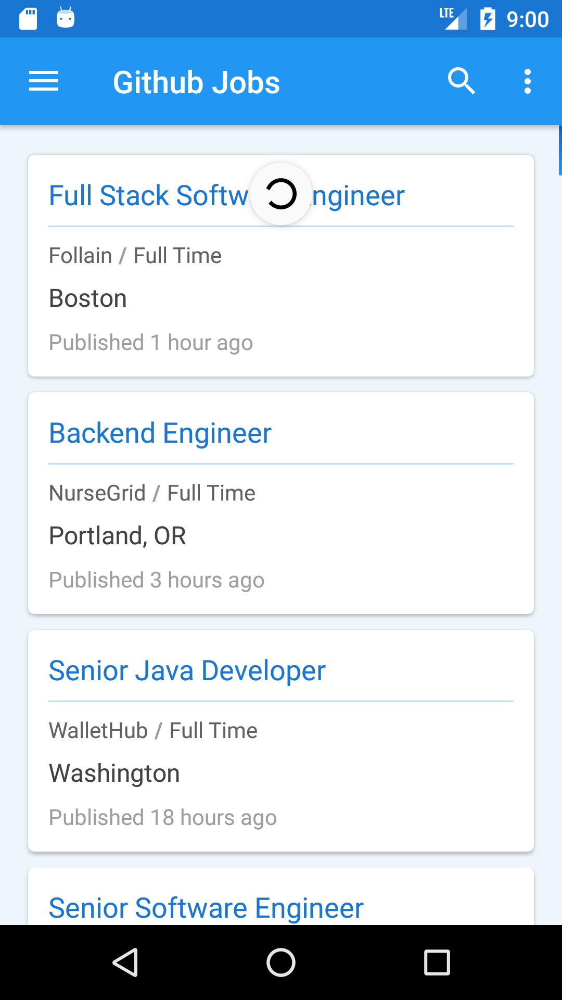

# Github Jobs
Application to show the current opened jobs from [Github jobs](https://jobs.github.com/). You 
can view and filter jobs by country, company name, title etc using the powerful search engine.

Technically, this application was developed using MVP architecture, divided in three 
modules:
* **app**: Android views, navigation, activities and fragments. If you want to contribute 
to the look & feel, you need touch this module
* **domain**: All business logic lives here!
* **data**: Manage persistence, to allow offline mode and fast data recovery. 

If you want to compile the application yourself see below.

## Building the application
First clone the project:
```sh
git clone https://github.com/fooock/android-github-jobs.git
```
Now, build the application in debug mode to generate the `apk` :
```sh
gradlew app:assembleDebug
```
If you want to know the current application version, you can execute the gradle task `printVersion`
which produces an output similar to the following:
```sh
+----------------------------------
| Version Name: 0.1-89-g27c749b
| Version Code: 1
| Version Code Time: 1517590824
+----------------------------------
```
> **Important!**
> If you find any bug, please attach this info in the issue tracker. For this example, the 
number `g27c749b` is the commit identifier, and it will allow me to do a checkout, create a new 
branch and upload the fix.

The application has two build types, and each one initialize things required for the given
case. For example, the *[debug](app/src/debug/java/com/fooock/github/jobs/DefaultApplication.java)* build type, initialize among other things:
* Log debug tree using `Timber` . This allows us print **only** in debug mode logs with `DEBUG` and `INFO`
tags, because normally, this logs can't be needed in release builds
* `LeakCanary` library, to look for memory leaks, and fix it!
* Database inspection using `Stetho`
* Enable `StrictMode` to detect all kind of problems

Note that in *[release](app/src/release/java/com/fooock/github/jobs/DefaultApplication.java)* 
mode, we only need to catch `WARNING`s and `ERROR`s, and send it to a crash reporting system.
For this purpose I created the [`CrashLibrary`](app/src/release/java/com/fooock/github/jobs/CrashLibrary.java) class

## Images

<p align="left">
    
    
    
    
    
</p>

## Tech stack
This project uses the following libraries. You can view for each module what library is
used in the [dependencies.gradle](buildsystem/dependencies.gradle) file.

* Android support libraries: *app-compat*, *constraint-layout*
* [RxJava](https://github.com/ReactiveX/RxJava)
* [Timber](https://github.com/JakeWharton/timber)
* [Butterknife](http://jakewharton.github.io/butterknife/)
* [Google OSS Licenses](https://developers.google.com/android/guides/opensource)
* [Retrofit 2 & Gson converter](http://square.github.io/retrofit/)
* [OkHttp3](https://github.com/square/okhttp)
* [Dagger2](https://google.github.io/dagger/)
* [Room persistence library](https://developer.android.com/topic/libraries/architecture/room.html)
* [Joda time](http://www.joda.org/joda-time/)

For application debug, I included:
* [Leak Canary](https://github.com/square/leakcanary)
* [Stetho](http://facebook.github.io/stetho/)

For application testing:
* [JUnit 4.12](http://junit.org/junit4/)
* [Mockito](http://site.mockito.org/)
* [Espresso](https://developer.android.com/training/testing/espresso/index.html)

## License
```
Copyright 2017 Javier (nhitbh at gmail dot com)

Licensed under the Apache License, Version 2.0 (the "License");
you may not use this file except in compliance with the License.
You may obtain a copy of the License at

    http://www.apache.org/licenses/LICENSE-2.0

Unless required by applicable law or agreed to in writing, software
distributed under the License is distributed on an "AS IS" BASIS,
WITHOUT WARRANTIES OR CONDITIONS OF ANY KIND, either express or implied.
See the License for the specific language governing permissions and
limitations under the License.
```